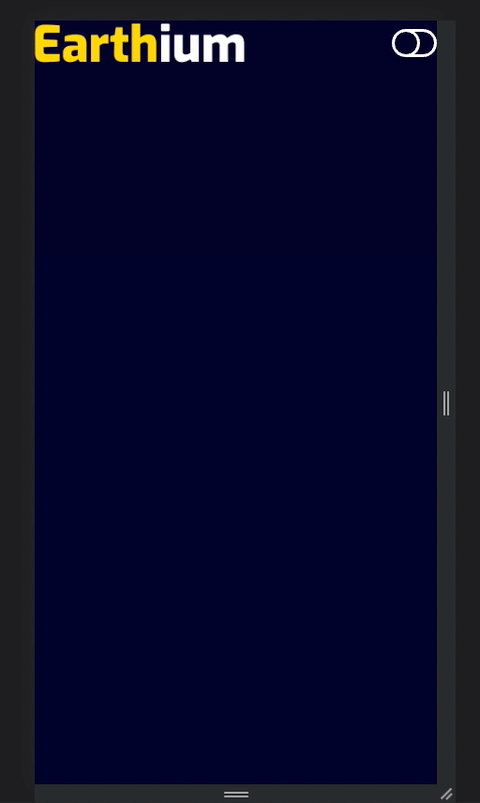

# Crypt Game Website - Responsive Website Design in REACT using Styled Components
Tutorial URL: https://www.youtube.com/watch?v=6oa_La0vGzQ
Tutorial description: A cryptocurrency gaming website built using React, react-icons & styled-components

___________

### Software versions

### Problems in the project:
1. Unexpected token, expected "}"
	```
		{navState ? (
			<BsToggleOn 
				onClick={() => setNavState(false)} />
					) : (

			<BsToggleOff 
				onClick={() => setNavState(true)} />)
		)}
	```
	There's only 2 pairs of parenthesis for encapsulating the HTML code required in this situation but my mind wanted to add another one.
2.

### How to use
1. clone / download
2. npm install
3. npm start OR yarn start
4. Navigate to localhost:3000
5. Scroll & hover over menu items.
6. Edit and add more features
### Photos of project:




### Apps used:

Sublime Text: [https://www.sublimetext.com/](https://www.sublimetext.com/) 

Tabby: [https://tabby.sh/](https://tabby.sh/) 

GitHub CLI: [https://cli.github.com/](https://cli.github.com/) 

Google Chrome: [https://www.google.com/chrome/dr/download/](https://www.google.com/chrome/dr/download/)

### Coding styles I used:

### What I learned
1. How to use styledComponents. First, create a styled component using a const variable and a styledComponents object. Then, use the component in the code. You can then use custom CSS to style it in backticks.
2. What Window.pageYOffset is. On Geeksforgeeks.org, pageYOffset is used for returning the pixels of the current document which have been scrolled from the upper left corner of the window vertically. It is a read-only property and it returns a number that represents the number of pixels that the document has already been scrolled from the upper left corner of the window vertically. 